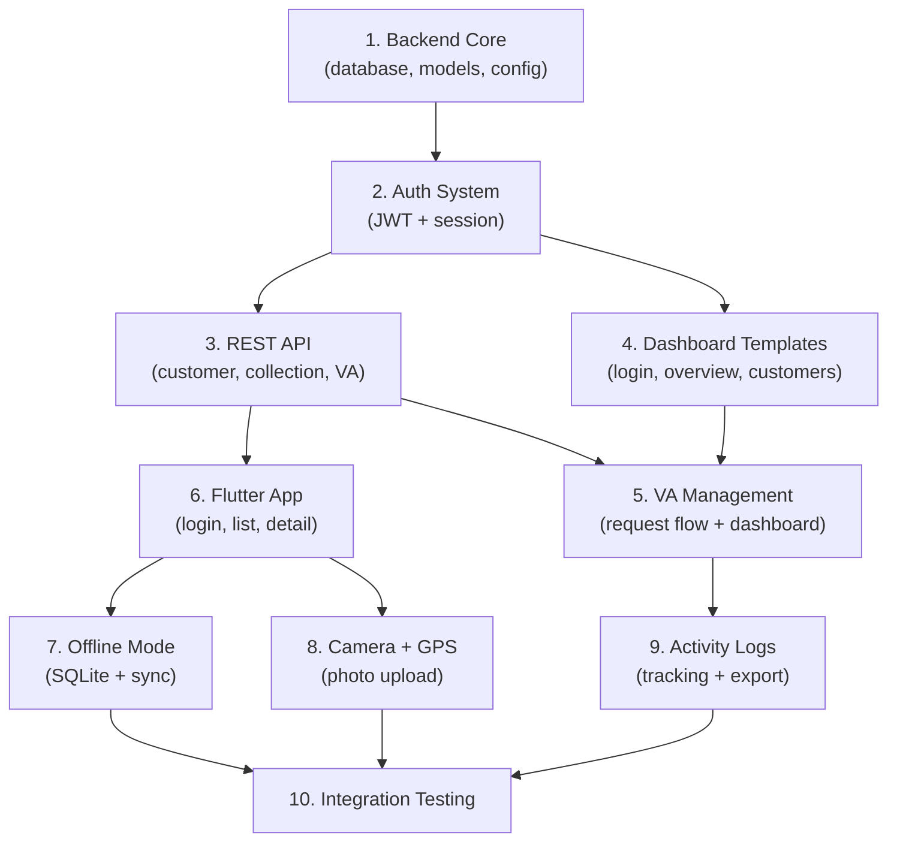

# 🎯 Field Collection System (P2P) — Implementation Plan

## Overview

Sistem collection lapangan P2P yang terdiri dari 3 komponen utama:
- **Backend** — FastAPI (REST API + HTML templates)
- **Dashboard Admin** — Jinja2 + Bootstrap 5 (server-rendered)
- **Mobile App** — Flutter (offline-first)

> [!IMPORTANT]
> Plan ini fokus pada **Phase 1 (MVP)** sesuai roadmap. Phase 2 & 3 akan direncanakan terpisah setelah Phase 1 stabil.

---

## User Review Required

> [!WARNING]
> **Database Configuration**: Plan ini menggunakan MySQL lokal (`root:@localhost`). Apakah Anda ingin menggunakan credentials berbeda atau remote database?

> [!WARNING]
> **Flutter setup**: Pastikan Flutter SDK sudah terinstall di mesin development. Apakah target platform Android only atau juga iOS?

> [!IMPORTANT]
> **Firebase FCM**: Diperlukan Firebase project + service account key untuk push notification. Apakah sudah ada project Firebase yang bisa digunakan, atau perlu dibuat baru? Untuk MVP, notifikasi bisa di-skip dulu dan pakai polling.

> [!IMPORTANT]
> **Photo Storage**: Untuk MVP, foto akan disimpan di local filesystem (`/uploads`). Apakah nanti mau migrate ke MinIO/S3, atau local storage sudah cukup untuk awal?

---

## Project Structure

```
collection-app/
├── backend/                          # FastAPI Backend
│   ├── main.py                       # App entry point
│   ├── requirements.txt
│   ├── alembic.ini
│   ├── alembic/                      # DB migrations
│   ├── core/
│   │   ├── config.py                 # Settings & env vars
│   │   ├── database.py               # SQLAlchemy engine + session
│   │   ├── security.py               # Password hashing
│   │   ├── jwt.py                    # JWT token create/verify
│   │   ├── dependencies.py           # get_db, get_current_user, etc.
│   │   └── templates.py              # Jinja2Templates instance
│   ├── models/
│   │   ├── user.py                   # Users table
│   │   ├── customer.py               # Customers table
│   │   ├── collection.py             # Collections table
│   │   ├── va_request.py             # VA Requests table
│   │   ├── va_data.py                # VA Data table
│   │   └── activity_log.py           # Activity Logs table
│   ├── schemas/
│   │   ├── user.py                   # Pydantic schemas (API)
│   │   ├── customer.py
│   │   ├── collection.py
│   │   └── va.py
│   ├── controllers/
│   │   ├── api/                      # REST API endpoints (for mobile)
│   │   │   ├── auth_api.py           # POST /api/login, refresh token
│   │   │   ├── customer_api.py       # GET /api/customers
│   │   │   ├── collection_api.py     # POST /api/collections
│   │   │   └── va_api.py             # POST /api/va/request
│   │   └── dashboard/                # HTML endpoints (for admin)
│   │       ├── auth_controller.py    # Login/logout pages
│   │       ├── dashboard_controller.py   # Overview page
│   │       ├── customer_controller.py    # Customer CRUD + upload
│   │       ├── va_controller.py          # VA management
│   │       └── activity_controller.py    # Activity logs
│   ├── services/
│   │   ├── auth_service.py
│   │   ├── collection_service.py
│   │   └── va_service.py
│   ├── static/
│   │   ├── css/
│   │   │   └── dashboard.css
│   │   └── js/
│   │       └── dashboard.js
│   ├── templates/
│   │   ├── base.html                 # Base layout (Bootstrap 5)
│   │   ├── login.html
│   │   ├── dashboard.html
│   │   ├── customers/
│   │   │   ├── list.html
│   │   │   └── detail.html
│   │   ├── va/
│   │   │   ├── list.html
│   │   │   └── create.html
│   │   └── activity/
│   │       └── list.html
│   └── uploads/                      # Photo storage (local)
│
└── mobile/                           # Flutter App
    └── collection_app/
        ├── lib/
        │   ├── main.dart
        │   ├── core/
        │   │   ├── api_client.dart        # HTTP client + auth
        │   │   ├── database_helper.dart   # SQLite local DB
        │   │   └── sync_service.dart      # Offline sync engine
        │   ├── models/
        │   │   ├── customer.dart
        │   │   ├── collection.dart
        │   │   └── va_request.dart
        │   ├── screens/
        │   │   ├── login_screen.dart
        │   │   ├── customer_list_screen.dart
        │   │   ├── customer_detail_screen.dart
        │   │   └── camera_screen.dart
        │   └── widgets/
        │       ├── status_badge.dart
        │       └── customer_card.dart
        └── pubspec.yaml
```

---

## Proposed Changes

### Component 1: Database Schema (MySQL)

Menggunakan SQLAlchemy ORM + Alembic migrations. Pattern mengikuti project VJR yang sudah ada.

#### [NEW] `models/user.py`
```python
class User(Base):
    __tablename__ = "users"
    id = Column(Integer, primary_key=True, autoincrement=True)
    name = Column(String(255), nullable=False)
    username = Column(String(100), unique=True, nullable=False)
    password = Column(String(255), nullable=False)  # bcrypt hash
    role = Column(String(20), nullable=False)        # 'admin' | 'agent'
    fcm_token = Column(String(500), nullable=True)   # Firebase token
    is_active = Column(Boolean, default=True)
    created_at = Column(DateTime, default=func.now())
```

#### [NEW] `models/customer.py`
```python
class Customer(Base):
    __tablename__ = "customers"
    id = Column(Integer, primary_key=True, autoincrement=True)
    name = Column(String(255), nullable=False)
    address = Column(Text, nullable=True)
    phone = Column(String(20), nullable=True)
    lat = Column(Float, nullable=True)              # GPS dari alamat
    lng = Column(Float, nullable=True)
    assigned_agent_id = Column(Integer, ForeignKey("users.id"), nullable=True)
    upload_batch = Column(String(100), nullable=True)  # batch code
    status = Column(String(20), default="belum")     # belum | janji_bayar | bayar
    created_at = Column(DateTime, default=func.now())
```

#### [NEW] `models/collection.py`
```python
class Collection(Base):
    __tablename__ = "collections"
    id = Column(Integer, primary_key=True, autoincrement=True)
    customer_id = Column(Integer, ForeignKey("customers.id"), nullable=False)
    agent_id = Column(Integer, ForeignKey("users.id"), nullable=False)
    status = Column(String(20), nullable=False)       # bayar | janji_bayar | tidak_ketemu
    notes = Column(Text, nullable=True)
    photo_url = Column(String(500), nullable=True)
    gps_lat = Column(Float, nullable=True)
    gps_lng = Column(Float, nullable=True)
    timestamp = Column(DateTime, nullable=False)
    synced_at = Column(DateTime, nullable=True)        # kapan data di-sync dari offline
    created_at = Column(DateTime, default=func.now())
```

#### [NEW] `models/va_request.py`
```python
class VaRequest(Base):
    __tablename__ = "va_requests"
    id = Column(Integer, primary_key=True, autoincrement=True)
    customer_id = Column(Integer, ForeignKey("customers.id"), nullable=False)
    agent_id = Column(Integer, ForeignKey("users.id"), nullable=False)
    notes = Column(Text, nullable=True)
    status = Column(String(20), default="pending")    # pending | completed
    created_at = Column(DateTime, default=func.now())
    updated_at = Column(DateTime, onupdate=func.now())
```

#### [NEW] `models/va_data.py`
```python
class VaData(Base):
    __tablename__ = "va_data"
    id = Column(Integer, primary_key=True, autoincrement=True)
    va_request_id = Column(Integer, ForeignKey("va_requests.id"), nullable=False)
    va_number = Column(String(100), nullable=False)
    bank_name = Column(String(100), nullable=False)
    amount = Column(BigInteger, nullable=True)
    created_by_admin = Column(Integer, ForeignKey("users.id"), nullable=False)
    created_at = Column(DateTime, default=func.now())
```

#### [NEW] `models/activity_log.py`
```python
class ActivityLog(Base):
    __tablename__ = "activity_logs"
    id = Column(Integer, primary_key=True, autoincrement=True)
    user_id = Column(Integer, ForeignKey("users.id"), nullable=False)
    action = Column(String(100), nullable=False)      # login | collection_update | upload_foto | request_va
    detail = Column(Text, nullable=True)               # JSON payload
    ip_address = Column(String(50), nullable=True)
    timestamp = Column(DateTime, default=func.now())
```

---

### Component 2: Backend — Core & Config

#### [NEW] `core/config.py`
- Database URL, JWT secret, token expiry, upload directory
- Load from `.env` file menggunakan `pydantic-settings`

#### [NEW] `core/database.py`
- SQLAlchemy engine + SessionLocal + Base
- `get_db()` dependency (sama pattern seperti VJR)
- `init_db()` untuk create tables

#### [NEW] `core/security.py`
- `hash_password()` dan `verify_password()` menggunakan passlib bcrypt

#### [NEW] `core/jwt.py`
- `create_access_token()` — JWT untuk mobile app
- `verify_token()` — decode + validate

#### [NEW] `core/dependencies.py`
- `get_current_user()` — extract user dari JWT (untuk API)
- `get_admin_user()` — extract user dari session (untuk dashboard)
- `require_role()` — role checker

#### [NEW] `core/templates.py`
- `Jinja2Templates` instance + custom filters

---

### Component 3: Backend — REST API (Mobile)

#### [NEW] `controllers/api/auth_api.py`
| Endpoint | Method | Description |
|---|---|---|
| `/api/auth/login` | POST | Login agent → JWT token |
| `/api/auth/me` | GET | Get current user info |
| `/api/auth/fcm-token` | PUT | Update FCM token |

#### [NEW] `controllers/api/customer_api.py`
| Endpoint | Method | Description |
|---|---|---|
| `/api/customers` | GET | List customers assigned to agent |
| `/api/customers/{id}` | GET | Customer detail + VA info |

#### [NEW] `controllers/api/collection_api.py`
| Endpoint | Method | Description |
|---|---|---|
| `/api/collections` | POST | Submit collection update (status + notes) |
| `/api/collections/upload-photo` | POST | Upload foto bukti (multipart) |
| `/api/collections/sync` | POST | Batch sync dari offline queue |

#### [NEW] `controllers/api/va_api.py`
| Endpoint | Method | Description |
|---|---|---|
| `/api/va/request` | POST | Request VA baru |
| `/api/va/{customer_id}` | GET | Get VA data untuk customer |

---

### Component 4: Backend — Dashboard (Admin)

#### [NEW] `controllers/dashboard/auth_controller.py`
| Route | Description |
|---|---|
| `GET /login` | Halaman login |
| `POST /login` | Process login → session |
| `GET /logout` | Logout + clear session |

#### [NEW] `controllers/dashboard/dashboard_controller.py`
| Route | Description |
|---|---|
| `GET /dashboard` | Overview: total customer, collection hari ini, pending VA |

#### [NEW] `controllers/dashboard/customer_controller.py`
| Route | Description |
|---|---|
| `GET /customers` | List semua customer (paginated, filterable) |
| `POST /customers/upload` | Upload CSV/Excel → bulk insert |
| `POST /customers/assign` | Assign customer ke agent |
| `POST /customers/{id}/delete` | Delete customer |

#### [NEW] `controllers/dashboard/va_controller.py`
| Route | Description |
|---|---|
| `GET /va-requests` | List VA requests (with status filter) |
| `POST /va-requests/{id}/create-va` | Admin input VA number → update status |

#### [NEW] `controllers/dashboard/activity_controller.py`
| Route | Description |
|---|---|
| `GET /activity-logs` | List activity logs (paginated) |
| `GET /activity-logs/export` | Export to Excel |

---

### Component 5: Dashboard Templates

Menggunakan Bootstrap 5 CDN. Simple, clean, functional.

#### [NEW] `templates/base.html`
- Bootstrap 5 layout: sidebar nav + content area
- Flash messages (success/error)
- User info in header

#### [NEW] `templates/login.html`
- Simple login form (username + password)

#### [NEW] `templates/dashboard.html`
- 3 stat cards: Total Customer, Collection Hari Ini, Pending VA
- Recent activity table

#### [NEW] `templates/customers/list.html`
- Table: name, address, agent, status
- Upload form (file + agent selection)
- Pagination

#### [NEW] `templates/customers/detail.html`
- Customer info + collection history + photos

#### [NEW] `templates/va/list.html`
- Table: customer, agent, notes, status, action
- Filter by status (pending/completed)
- Modal form untuk input VA

#### [NEW] `templates/activity/list.html`
- Table: user, action, detail, timestamp
- Filter by action type / date range
- Export Excel button

---

### Component 6: Flutter Mobile App

#### App Structure

```
lib/
├── main.dart                         # Entry point + routing
├── core/
│   ├── constants.dart                # API base URL, colors
│   ├── api_client.dart               # Dio HTTP client + JWT interceptor
│   ├── database_helper.dart          # SQLite (sqflite)
│   └── sync_service.dart             # Background sync engine
├── models/
│   ├── customer.dart                 # Customer model + fromJson/toJson
│   ├── collection_record.dart        # Collection record
│   └── va_data.dart                  # VA data
├── providers/
│   ├── auth_provider.dart            # Auth state (ChangeNotifier)
│   ├── customer_provider.dart        # Customer list state
│   └── sync_provider.dart            # Sync status
├── screens/
│   ├── login_screen.dart             # Login page
│   ├── home_screen.dart              # Tab: customer list + sync status
│   ├── customer_list_screen.dart     # List with status filter
│   ├── customer_detail_screen.dart   # Detail + action buttons
│   ├── update_status_screen.dart     # Quick status update
│   └── camera_screen.dart            # Take photo + GPS + timestamp
└── widgets/
    ├── status_badge.dart             # Color-coded status chip
    ├── customer_card.dart            # List item card
    ├── sync_indicator.dart           # Online/offline indicator
    └── action_button.dart            # Big action buttons
```

#### Key Features Implementation

**Offline-First Architecture:**
1. On login → fetch semua customer data → simpan ke SQLite
2. Semua operasi (update status, request VA) → simpan ke local queue terlebih dahulu
3. `SyncService` berjalan di background → cek koneksi → process queue → push ke server
4. Pull new data dari server saat online → merge ke local DB

**Camera + GPS + Timestamp:**
1. Gunakan `image_picker` untuk capture foto
2. `geolocator` untuk GPS coordinates
3. Compress image dengan `flutter_image_compress` (max 500KB)
4. Overlay timestamp watermark menggunakan `image` package
5. Simpan file locally → queue upload

**VA Feature:**
1. Check apakah customer sudah punya VA aktif
2. Jika belum → tampil button "Request VA"
3. Jika sudah → tampil VA number + copy button
4. Polling server untuk check VA update

#### Flutter Dependencies (pubspec.yaml)
```yaml
dependencies:
  flutter:
    sdk: flutter
  provider: ^6.0.0              # State management
  dio: ^5.0.0                   # HTTP client
  sqflite: ^2.3.0               # Local SQLite
  path_provider: ^2.1.0         # File paths
  image_picker: ^1.0.0          # Camera
  geolocator: ^10.0.0           # GPS
  flutter_image_compress: ^2.0.0 # Image compression
  connectivity_plus: ^5.0.0     # Network status
  shared_preferences: ^2.2.0    # Token storage
  workmanager: ^0.5.0           # Background tasks
  url_launcher: ^6.2.0          # Google Maps launch
  clipboard: ^0.1.3             # Copy VA number
  intl: ^0.18.0                 # Date formatting
```

---

## Business Logic Rules

| Rule | Implementation |
|---|---|
| 1 customer = max 1 VA aktif | Unique constraint + service check sebelum create request |
| Semua aktivitas ada timestamp | `created_at` default + `ActivityLog` auto-insert |
| Track siapa request VA | `agent_id` di `va_requests` |
| Track siapa create VA | `created_by_admin` di `va_data` |
| Foto wajib GPS + timestamp | Client-side validation di Flutter + server-side check |
| Offline data sync ulang | Queue table di SQLite + retry logic di SyncService |
| Status colors | Merah=belum, Kuning=janji_bayar, Hijau=bayar |
| Max 3 klik untuk aksi | Direct action buttons di customer detail screen |

---

## Development Order (Phase 1 MVP)

Urutan implementasi yang optimal:



### Step-by-step:

1. **Backend Core** — Database setup, all models, Alembic init
2. **Auth System** — JWT (mobile) + Session (dashboard), login/logout
3. **REST API** — Semua API endpoint untuk mobile
4. **Dashboard Templates** — Login, dashboard overview, customer list
5. **VA Management** — Full flow: agent request → admin input → agent view
6. **Flutter App** — Login, customer list, detail, update status
7. **Offline Mode** — SQLite storage, sync queue, auto-retry
8. **Camera + GPS** — Photo capture, compression, watermark, upload
9. **Activity Logs** — Logging middleware, log viewer, Excel export
10. **Integration Testing** — End-to-end: mobile → API → dashboard

---

## Open Questions

> [!IMPORTANT]
> 1. **Database name**: Mau pakai nama database apa? Suggestion: `collection_db`
> 2. **Admin seeding**: Apakah perlu auto-create admin user pertama saat init DB?
> 3. **Customer upload format**: Kolom apa saja yang wajib di CSV/Excel? (minimal: nama, alamat, phone?)
> 4. **VA number format**: Apakah ada format khusus untuk VA number, atau free text?
> 5. **Photo watermark**: Ingin watermark text apa selain timestamp? (contoh: nama agent, GPS coordinates?)

---

## Verification Plan

### Automated Tests

```bash
# Backend tests
cd backend
python -m pytest tests/ -v

# Run the server
python -m venv venv
.\venv\Scripts\activate
uvicorn main:app --host 0.0.0.0 --port 8001 --reload
uvicorn main:app --reload --port 8001

# Flutter tests  
cd mobile/collection_app
flutter create --platforms=android .
flutter run
```

### Manual Verification
1. **Login Flow** — Admin login di dashboard, Agent login di mobile
2. **Customer Management** — Upload CSV → assign agent → verify di mobile
3. **Collection Flow** — Agent update status + foto → verify di dashboard
4. **VA Flow** — Agent request → Admin create VA → Agent view VA
5. **Offline Mode** — Turn off WiFi → do actions → turn on → verify sync
6. **Activity Tracking** — Check semua aksi tercatat di activity logs
